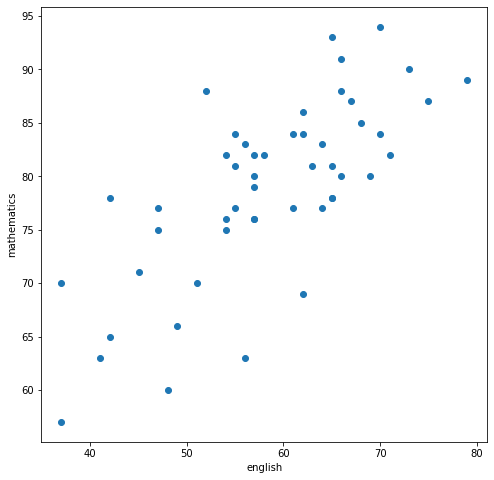
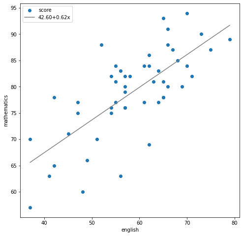
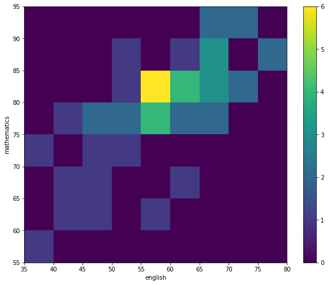
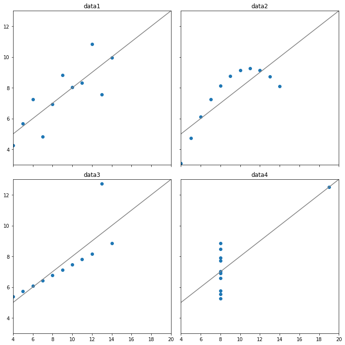

## 2차원  데이터의  정리
### 두 데이터 사이의 관계를 나타내는 지표


```python
import numpy as np
import pandas as pd
%precision 3
pd.set_option('display.float_format','{:,.3f}'.format)
# pd.set_option('display.precision', 3)
```


```python
df = pd.read_csv('C:\ds_work\data\scores_em.csv',index_col= 'student number')
df
```


<div>
<style scoped>
    .dataframe tbody tr th:only-of-type {
        vertical-align: middle;
    }

    .dataframe tbody tr th {
        vertical-align: top;
    }

    .dataframe thead th {
        text-align: right;
    }
</style>
<table border="1" class="dataframe">
  <thead>
    <tr style="text-align: right;">
      <th></th>
      <th>english</th>
      <th>mathematics</th>
    </tr>
    <tr>
      <th>student number</th>
      <th></th>
      <th></th>
    </tr>
  </thead>
  <tbody>
    <tr>
      <th>1</th>
      <td>42</td>
      <td>65</td>
    </tr>
    <tr>
      <th>2</th>
      <td>69</td>
      <td>80</td>
    </tr>
    <tr>
      <th>3</th>
      <td>56</td>
      <td>63</td>
    </tr>
    <tr>
      <th>4</th>
      <td>41</td>
      <td>63</td>
    </tr>
    <tr>
      <th>5</th>
      <td>57</td>
      <td>76</td>
    </tr>
    <tr>
      <th>6</th>
      <td>48</td>
      <td>60</td>
    </tr>
    <tr>
      <th>7</th>
      <td>65</td>
      <td>81</td>
    </tr>
    <tr>
      <th>8</th>
      <td>49</td>
      <td>66</td>
    </tr>
    <tr>
      <th>9</th>
      <td>65</td>
      <td>78</td>
    </tr>
    <tr>
      <th>10</th>
      <td>58</td>
      <td>82</td>
    </tr>
    <tr>
      <th>11</th>
      <td>70</td>
      <td>94</td>
    </tr>
    <tr>
      <th>12</th>
      <td>47</td>
      <td>75</td>
    </tr>
    <tr>
      <th>13</th>
      <td>51</td>
      <td>70</td>
    </tr>
    <tr>
      <th>14</th>
      <td>64</td>
      <td>77</td>
    </tr>
    <tr>
      <th>15</th>
      <td>62</td>
      <td>84</td>
    </tr>
    <tr>
      <th>16</th>
      <td>70</td>
      <td>84</td>
    </tr>
    <tr>
      <th>17</th>
      <td>71</td>
      <td>82</td>
    </tr>
    <tr>
      <th>18</th>
      <td>68</td>
      <td>85</td>
    </tr>
    <tr>
      <th>19</th>
      <td>73</td>
      <td>90</td>
    </tr>
    <tr>
      <th>20</th>
      <td>37</td>
      <td>70</td>
    </tr>
    <tr>
      <th>21</th>
      <td>65</td>
      <td>78</td>
    </tr>
    <tr>
      <th>22</th>
      <td>65</td>
      <td>93</td>
    </tr>
    <tr>
      <th>23</th>
      <td>61</td>
      <td>77</td>
    </tr>
    <tr>
      <th>24</th>
      <td>52</td>
      <td>88</td>
    </tr>
    <tr>
      <th>25</th>
      <td>57</td>
      <td>82</td>
    </tr>
    <tr>
      <th>26</th>
      <td>57</td>
      <td>76</td>
    </tr>
    <tr>
      <th>27</th>
      <td>75</td>
      <td>87</td>
    </tr>
    <tr>
      <th>28</th>
      <td>61</td>
      <td>84</td>
    </tr>
    <tr>
      <th>29</th>
      <td>47</td>
      <td>77</td>
    </tr>
    <tr>
      <th>30</th>
      <td>54</td>
      <td>82</td>
    </tr>
    <tr>
      <th>31</th>
      <td>66</td>
      <td>91</td>
    </tr>
    <tr>
      <th>32</th>
      <td>54</td>
      <td>75</td>
    </tr>
    <tr>
      <th>33</th>
      <td>54</td>
      <td>76</td>
    </tr>
    <tr>
      <th>34</th>
      <td>42</td>
      <td>78</td>
    </tr>
    <tr>
      <th>35</th>
      <td>37</td>
      <td>57</td>
    </tr>
    <tr>
      <th>36</th>
      <td>79</td>
      <td>89</td>
    </tr>
    <tr>
      <th>37</th>
      <td>56</td>
      <td>83</td>
    </tr>
    <tr>
      <th>38</th>
      <td>62</td>
      <td>69</td>
    </tr>
    <tr>
      <th>39</th>
      <td>62</td>
      <td>86</td>
    </tr>
    <tr>
      <th>40</th>
      <td>55</td>
      <td>81</td>
    </tr>
    <tr>
      <th>41</th>
      <td>63</td>
      <td>81</td>
    </tr>
    <tr>
      <th>42</th>
      <td>57</td>
      <td>80</td>
    </tr>
    <tr>
      <th>43</th>
      <td>57</td>
      <td>79</td>
    </tr>
    <tr>
      <th>44</th>
      <td>67</td>
      <td>87</td>
    </tr>
    <tr>
      <th>45</th>
      <td>55</td>
      <td>84</td>
    </tr>
    <tr>
      <th>46</th>
      <td>45</td>
      <td>71</td>
    </tr>
    <tr>
      <th>47</th>
      <td>66</td>
      <td>80</td>
    </tr>
    <tr>
      <th>48</th>
      <td>55</td>
      <td>77</td>
    </tr>
    <tr>
      <th>49</th>
      <td>64</td>
      <td>83</td>
    </tr>
    <tr>
      <th>50</th>
      <td>66</td>
      <td>88</td>
    </tr>
  </tbody>
</table>
</div>


```python
en_scores = np.array(df['english'])[:10]
ma_scores = np.array(df['mathematics'])[:10]
scores_df = pd.DataFrame({'english':en_scores, 'mathematics':ma_scores},
                        index= pd.Index(['A', 'B', 'C', 'D', 'E','F', 'G', 'H', 'I', 'J'], 
                        name= 'student'))
scores_df
```


<div>
<style scoped>
    .dataframe tbody tr th:only-of-type {
        vertical-align: middle;
    }

    .dataframe tbody tr th {
        vertical-align: top;
    }

    .dataframe thead th {
        text-align: right;
    }
</style>
<table border="1" class="dataframe">
  <thead>
    <tr style="text-align: right;">
      <th></th>
      <th>english</th>
      <th>mathematics</th>
    </tr>
    <tr>
      <th>student</th>
      <th></th>
      <th></th>
    </tr>
  </thead>
  <tbody>
    <tr>
      <th>A</th>
      <td>42</td>
      <td>65</td>
    </tr>
    <tr>
      <th>B</th>
      <td>69</td>
      <td>80</td>
    </tr>
    <tr>
      <th>C</th>
      <td>56</td>
      <td>63</td>
    </tr>
    <tr>
      <th>D</th>
      <td>41</td>
      <td>63</td>
    </tr>
    <tr>
      <th>E</th>
      <td>57</td>
      <td>76</td>
    </tr>
    <tr>
      <th>F</th>
      <td>48</td>
      <td>60</td>
    </tr>
    <tr>
      <th>G</th>
      <td>65</td>
      <td>81</td>
    </tr>
    <tr>
      <th>H</th>
      <td>49</td>
      <td>66</td>
    </tr>
    <tr>
      <th>I</th>
      <td>65</td>
      <td>78</td>
    </tr>
    <tr>
      <th>J</th>
      <td>58</td>
      <td>82</td>
    </tr>
  </tbody>
</table>
</div>


### 공분산


```python
summary_df = scores_df.copy() 
summary_df['english_deviation'] = \
summary_df['english'] - summary_df['english'].mean() 
summary_df['mathematics_deviation'] = \
summary_df['mathematics'] - summary_df['mathematics'].mean() 
summary_df['product of deviations'] = \
summary_df['english_deviation'] * summary_df['mathematics_deviation'] 
summary_df
```


<div>
<style scoped>
    .dataframe tbody tr th:only-of-type {
        vertical-align: middle;
    }

    .dataframe tbody tr th {
        vertical-align: top;
    }

    .dataframe thead th {
        text-align: right;
    }
</style>
<table border="1" class="dataframe">
  <thead>
    <tr style="text-align: right;">
      <th></th>
      <th>english</th>
      <th>mathematics</th>
      <th>english_deviation</th>
      <th>mathematics_deviation</th>
      <th>product of deviations</th>
    </tr>
    <tr>
      <th>student</th>
      <th></th>
      <th></th>
      <th></th>
      <th></th>
      <th></th>
    </tr>
  </thead>
  <tbody>
    <tr>
      <th>A</th>
      <td>42</td>
      <td>65</td>
      <td>-13.000</td>
      <td>-6.400</td>
      <td>83.200</td>
    </tr>
    <tr>
      <th>B</th>
      <td>69</td>
      <td>80</td>
      <td>14.000</td>
      <td>8.600</td>
      <td>120.400</td>
    </tr>
    <tr>
      <th>C</th>
      <td>56</td>
      <td>63</td>
      <td>1.000</td>
      <td>-8.400</td>
      <td>-8.400</td>
    </tr>
    <tr>
      <th>D</th>
      <td>41</td>
      <td>63</td>
      <td>-14.000</td>
      <td>-8.400</td>
      <td>117.600</td>
    </tr>
    <tr>
      <th>E</th>
      <td>57</td>
      <td>76</td>
      <td>2.000</td>
      <td>4.600</td>
      <td>9.200</td>
    </tr>
    <tr>
      <th>F</th>
      <td>48</td>
      <td>60</td>
      <td>-7.000</td>
      <td>-11.400</td>
      <td>79.800</td>
    </tr>
    <tr>
      <th>G</th>
      <td>65</td>
      <td>81</td>
      <td>10.000</td>
      <td>9.600</td>
      <td>96.000</td>
    </tr>
    <tr>
      <th>H</th>
      <td>49</td>
      <td>66</td>
      <td>-6.000</td>
      <td>-5.400</td>
      <td>32.400</td>
    </tr>
    <tr>
      <th>I</th>
      <td>65</td>
      <td>78</td>
      <td>10.000</td>
      <td>6.600</td>
      <td>66.000</td>
    </tr>
    <tr>
      <th>J</th>
      <td>58</td>
      <td>82</td>
      <td>3.000</td>
      <td>10.600</td>
      <td>31.800</td>
    </tr>
  </tbody>
</table>
</div>


```python
summary_df['product of deviations'].mean()
```


    62.800


```python
cov_mat = np.cov(en_scores, ma_scores, ddof= 0) 
cov_mat
```


    array([[86.  , 62.8 ],
           [62.8 , 68.44]])


```python
cov_mat[0, 1], cov_mat[1, 0]
```


    (62.800, 62.800)


```python
cov_mat[0, 0], cov_mat[1, 1]
```


    (86.000, 68.440)


```python
np.var(en_scores, ddof= 0), np.var(ma_scores, ddof= 0)
```


    (86.000, 68.440)


### 상관계수


```python
np.cov(en_scores, ma_scores, ddof= 0)[0, 1] /\
    (np.std(en_scores) * np.std(ma_scores))
```


    0.819


```python
np.corrcoef(en_scores, ma_scores)
```


    array([[1.   , 0.819],
           [0.819, 1.   ]])


```python
scores_df.corr()
```


<div>
<style scoped>
    .dataframe tbody tr th:only-of-type {
        vertical-align: middle;
    }

    .dataframe tbody tr th {
        vertical-align: top;
    }

    .dataframe thead th {
        text-align: right;
    }
</style>
<table border="1" class="dataframe">
  <thead>
    <tr style="text-align: right;">
      <th></th>
      <th>english</th>
      <th>mathematics</th>
    </tr>
  </thead>
  <tbody>
    <tr>
      <th>english</th>
      <td>1.000</td>
      <td>0.819</td>
    </tr>
    <tr>
      <th>mathematics</th>
      <td>0.819</td>
      <td>1.000</td>
    </tr>
  </tbody>
</table>
</div>


## 2차원  데이터의  시각화 
### 산점도


```python
import matplotlib.pyplot as plt 
%matplotlib inline
```


```python
english_scores = np.array(df['english']) 
math_scores = np.array(df['mathematics'])
fig = plt.figure(figsize= (8, 8)) 
ax = fig.add_subplot(111)
# 산점도
ax.scatter(english_scores, math_scores) 
ax.set_xlabel('english')
ax.set_ylabel('mathematics') 
plt.show()
```


    

    


### 회귀직선


```python
# 계수β_0와β_1를 구한다
poly_fit = np.polyfit(english_scores, math_scores, 1) 
# β_0+β_1 x를 반환하는 함수를 작성
poly_1d = np.poly1d(poly_fit) 
# 직선을 그리기 위해 x좌표를 생성
xs = np.linspace(english_scores.min(), english_scores.max()) 
# xs에 대응하는 y좌표를 구한다
ys = poly_1d(xs)
fig = plt.figure(figsize= (8, 8)) 
ax = fig.add_subplot(111)
ax.set_xlabel('english')
ax.set_ylabel('mathematics')
ax.scatter(english_scores, math_scores, label= 'score') 
ax.plot(xs, ys, color= 'gray',
label= f'{poly_fit[1]:.2f}+{poly_fit[0]:.2f}x')
# 범례의 표시
ax.legend(loc= 'upper left') 
plt.show()
```


    

    


### 히트맵


```python
fig = plt.figure(figsize= (10, 8)) 
ax = fig.add_subplot(111)
c = ax.hist2d(english_scores, math_scores,
                bins= [9, 8], range= [(35, 80), (55, 95)])
ax.set_xlabel('english')
ax.set_ylabel('mathematics') 
ax.set_xticks(c[1])
ax.set_yticks(c[2]) 
# 컬러 바의 표시
fig.colorbar(c[3], ax= ax) 
plt.show()
```


    

    


## 앤스컴의  예


```python
# npy 형식으로 저장된 NumPy array를 읽음 
anscombe_data = np.load('C:/ds_work/data/anscombe.npy') 
print(anscombe_data.shape)
anscombe_data[0]
```

    (4, 11, 2)
    


    array([[10.  ,  8.04],
           [ 8.  ,  6.95],
           [13.  ,  7.58],
           [ 9.  ,  8.81],
           [11.  ,  8.33],
           [14.  ,  9.96],
           [ 6.  ,  7.24],
           [ 4.  ,  4.26],
           [12.  , 10.84],
           [ 7.  ,  4.82],
           [ 5.  ,  5.68]])


```python
stats_df = pd.DataFrame(index= ['X_mean', 'X_variance', 'Y_mean',
                                'Y_variance', 'X&Y_correlation', 
                                'X&Y_regression line'])
for i, data in enumerate(anscombe_data): 
    dataX = data[:, 0]
    dataY = data[:, 1]
    poly_fit = np.polyfit(dataX, dataY, 1) 
    stats_df[f'data{i+ 1}'] = \
        [f'{np.mean(dataX):.2f}',
         f'{np.var(dataX):.2f}', 
         f'{np.mean(dataY):.2f}', 
         f'{np.var(dataY):.2f}',
         f'{np.corrcoef(dataX, dataY)[0, 1]:.2f}', 
         f'{poly_fit[1]:.2f}+{poly_fit[0]:.2f}x']
stats_df
```


<div>
<style scoped>
    .dataframe tbody tr th:only-of-type {
        vertical-align: middle;
    }

    .dataframe tbody tr th {
        vertical-align: top;
    }

    .dataframe thead th {
        text-align: right;
    }
</style>
<table border="1" class="dataframe">
  <thead>
    <tr style="text-align: right;">
      <th></th>
      <th>data1</th>
      <th>data2</th>
      <th>data3</th>
      <th>data4</th>
    </tr>
  </thead>
  <tbody>
    <tr>
      <th>X_mean</th>
      <td>9.00</td>
      <td>9.00</td>
      <td>9.00</td>
      <td>9.00</td>
    </tr>
    <tr>
      <th>X_variance</th>
      <td>10.00</td>
      <td>10.00</td>
      <td>10.00</td>
      <td>10.00</td>
    </tr>
    <tr>
      <th>Y_mean</th>
      <td>7.50</td>
      <td>7.50</td>
      <td>7.50</td>
      <td>7.50</td>
    </tr>
    <tr>
      <th>Y_variance</th>
      <td>3.75</td>
      <td>3.75</td>
      <td>3.75</td>
      <td>3.75</td>
    </tr>
    <tr>
      <th>X&amp;Y_correlation</th>
      <td>0.82</td>
      <td>0.82</td>
      <td>0.82</td>
      <td>0.82</td>
    </tr>
    <tr>
      <th>X&amp;Y_regression line</th>
      <td>3.00+0.50x</td>
      <td>3.00+0.50x</td>
      <td>3.00+0.50x</td>
      <td>3.00+0.50x</td>
    </tr>
  </tbody>
</table>
</div>


```python
# 그래프를 그리기 위한 영역을 2x2개 생성
fig, axes = plt.subplots(nrows= 2, ncols= 2, figsize= (10, 10),
                        sharex= True , sharey= True)
xs = np.linspace(0, 30, 100)
for i, data in enumerate(anscombe_data):
    poly_fit = np.polyfit(data[:,0], data[:,1], 1) 
    poly_1d = np.poly1d(poly_fit)
    ys = poly_1d(xs)
    # 그리는 영역을 선택 
    ax = axes[i//2, i% 2] 
    ax.set_xlim([4, 20]) 
    ax.set_ylim([3, 13]) 
    # 타이틀을 부여
    ax.set_title(f'data{i+ 1}')
    ax.scatter(data[:,0], data[:,1]) 
    ax.plot(xs, ys, color= 'gray')
# 그래프 사이의 간격을 좁힘
plt.tight_layout() 
plt.show()
```


    

    

